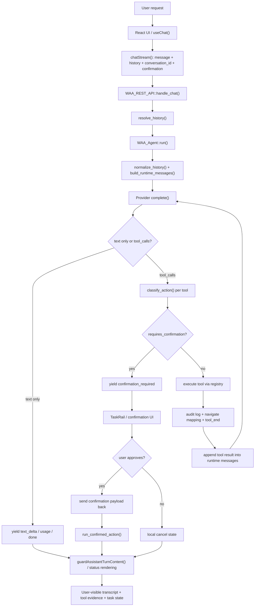

# Runtime V1 Orchestration Analysis

## 1. Mục đích của note này

Note này chỉ tập trung vào một câu hỏi:

> Khi plugin nhận yêu cầu, nó điều phối model, tool, state, confirmation, và UI như thế nào?

Đây là phần rất quan trọng nếu muốn giải thích vì sao Runtime V1 đã "lai tinh thần Codex" hơn bản cũ.

Điểm cần dạy rõ:

- đây **chưa phải** orchestration kiểu multi-agent đầy đủ
- nhưng nó **đã là** một runtime orchestration loop có policy, state, evidence, và verification

---

## 2. Orchestration ở đây nghĩa là gì?

Trong bối cảnh plugin này, orchestration không phải là:

- có nhiều agent con
- có scheduler nền lớn
- có planner nhiều tầng

Orchestration ở Runtime V1 hiện tại nghĩa là:

1. nhận yêu cầu từ UI
2. resolve đúng session/history
3. build context gửi model
4. nhận lại text và tool calls
5. quyết định tool nào được chạy, tool nào phải chờ confirm
6. chạy tool và ghi log
7. đối chiếu text với kết quả thật
8. trả lại UI một trạng thái có thể tin được

Nói gọn:

> Đây là orchestration của **một bounded tool-using runtime**, không chỉ là "chat rồi gọi hàm".

---

## 3. Sơ đồ orchestration tổng quát

---

## 4. Các pha orchestration chính

### 4.1. Intake phase

Đầu vào của hệ thống không chỉ là text.

Ở `src/lib/api.js`, frontend gửi:

- `message`
- `history`
- `conversation_id`
- `confirmation`

Điều này rất khác với kiểu chatbot đơn giản chỉ gửi mỗi prompt text.

Ý nghĩa:

- orchestration có state từ đầu vào
- request hiện tại được gắn với một phiên và một trạng thái chạy trước đó

### 4.2. State resolution phase

Ở `includes/class-rest-api.php`, `handle_chat()` không đẩy request thẳng sang model.

Nó gọi:

- `resolve_history()`

Logic:

- nếu request có `history` inline thì dùng history đó
- nếu không, nhưng có `conversation_id`, thì load history từ conversation đã lưu

Ý nghĩa:

- session continuity không bị phó mặc cho model
- orchestration có lớp resolve state trước khi suy nghĩ bước tiếp theo

### 4.3. Context shaping phase

Ở `includes/class-agent.php`:

- `normalize_history()`
- `build_runtime_messages()`

Tại đây runtime:

- lọc bỏ message sai shape
- giữ đúng contract `user / assistant / tool`
- cắt history theo window giới hạn
- bỏ orphan `tool` ở đầu context window

Ý nghĩa:

- trước khi model suy luận, runtime đã làm sạch sân chơi
- orchestration không chỉ là forward message, mà còn là context governance

### 4.4. Proposal phase

Sau khi gọi provider:

- model có thể trả `text`
- model có thể trả `tool_calls`

Điểm quan trọng:

- model đang ở vai trò **proposal engine**
- nó chưa phải execution authority

Đây là chỗ "giống Codex":

> model đề xuất, runtime xét duyệt và điều phối

### 4.5. Policy gate phase

Đây là pha quan trọng nhất của orchestration hiện tại.

Mỗi tool call đi qua:

- `classify_action()`

Runtime tự gán:

- `action_type`
- `risk_level`
- `requires_confirmation`
- `is_async`
- `current_state`
- `proposed_state`

Ví dụ:

- `install_plugin` -> sensitive + confirm
- `switch_theme` -> destructive + confirm
- `create_post status=draft` -> safe
- `create_post status=publish` -> confirm
- `wordfence_run_scan` -> async/background, không confirm

Ý nghĩa:

- orchestration không để model tự quyết "có nên chạy luôn không"
- policy nằm trong code

### 4.6. Execution phase

Nếu action được phép chạy ngay:

- runtime phát `tool_start`
- gọi `registry->execute(...)`
- ghi `audit log`
- phát `tool_end`
- map `navigate` nếu có
- append tool result vào messages để iteration sau dùng tiếp

Điểm đáng dạy:

- tool result quay lại runtime loop, không chỉ quay ra UI
- orchestration là vòng lặp có feedback, không phải một chiều

### 4.7. Confirmation branch

Nếu action cần confirm:

- runtime không chạy tool
- runtime phát `confirmation_required`
- UI render `TaskRail`
- user approve thì frontend gửi lại payload `confirmation`
- backend chạy `run_confirmed_action()`

Ý nghĩa:

- approval là một nhánh orchestration thật
- không phải chỉ là assistant hỏi xã giao

### 4.8. Verification phase

Sau khi tool chạy xong, hệ thống vẫn chưa coi text của assistant là chân lý.

Ở `src/hooks/useChat.js`:

- `guardAssistantTurnContent()`

Nó kiểm:

- tool fail nhưng text lại nói như thành công
- async chỉ mới `queued` nhưng text lại nói như đã hoàn tất

Ý nghĩa:

- orchestration có pha hậu kiểm
- text phải phục tùng result, không phải ngược lại

---

## 5. Điều gì làm orchestration này "lai .codex"?

Không phải vì nó giống UI của Codex.

Nó giống ở mấy nguyên tắc sau:

### A. Runtime owns state

- session
- history
- pending confirmation
- async follow-up metadata

### B. Runtime owns policy

- tool nào được chạy
- tool nào phải confirm
- action nào là async

### C. Runtime owns verification

- assistant text không override tool result

### D. Runtime keeps evidence

- transcript
- tool evidence
- usage
- navigate hint
- queued state

Tức là:

> đây là một orchestration loop có authority, không phải một thin wrapper quanh model API.

---

## 6. Những test case chứng minh orchestration này có thật

### Case 1. Session restore rồi chat tiếp

Xem:

- `tests/php/integration/RestApiSafetyTest.php`

Điểm chứng minh:

- runtime load được persisted history
- tool evidence cũ vẫn ảnh hưởng iteration mới

### Case 2. Multi-step rồi dừng ở confirmation

Xem:

- `tests/js/hooks/useChat.test.js`

Điểm chứng minh:

- model có thể đi qua `list_plugins`
- sau đó mới tới `install_plugin`
- UI vẫn giữ evidence của bước trước khi chờ confirm

### Case 3. Approve -> replay confirmed action

Xem:

- `tests/js/hooks/useChat.test.js`
- `tests/e2e/confirmation.spec.js`

Điểm chứng minh:

- nhánh approval là execution branch thật
- không phải text-only branch

### Case 4. Async queued bị chặn overclaim

Xem:

- `tests/js/hooks/useChat.test.js`
- `tests/e2e/hallucination-guards.spec.js`

Điểm chứng minh:

- orchestration có hậu kiểm
- model không được độc quyền kể chuyện trạng thái

---

## 7. Giới hạn hiện tại của orchestration

Phải nói rõ để tránh dạy quá tay.

Runtime V1 orchestration hiện **chưa có**:

- planner nhiều bước có object plan rõ ràng
- entity resolution đầy đủ cho mọi tool
- long-term memory thật
- semantic retrieval
- background job orchestration hoàn chỉnh
- multi-agent routing

Vì vậy mô tả đúng là:

> Đây là orchestration loop một-agent, bounded, tool-driven, có state + policy + verification.

Chưa phải:

> một agent OS đầy đủ.

---

## 8. Câu chốt để giảng

Nếu chỉ nói một câu:

> Giá trị lớn nhất của Runtime V1 không nằm ở chuyện model trả lời hay hơn, mà nằm ở chỗ runtime đã đứng ra điều phối vòng đời của request, tool, state, và sự thật.
